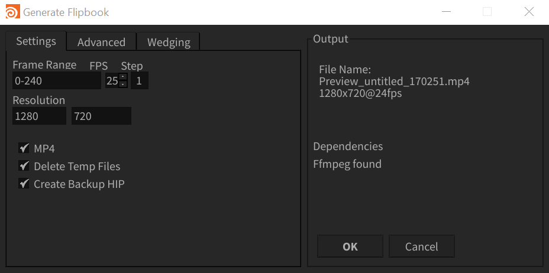

# Tools I've written for Houdini

---
## Flipbook Advanced 

*Requires FFMpeg as a Dependency*
### Features
1. Automatically create MP4 from Flipbooks
2. Create snapshots of your hipfile
3. Overlay hipfile, frame or other Watermarks
4. Automatically creates subdirectories and cleans up

**WIP**
Currently only changing Frame Range and Resolution works within the UI
Wedges are not currently implemented
